# MCU外围电路设计

## 1. 复位电路

​		根据stm32f1xx系列芯片硬件设计参考手册([文件编号：AN2586](https://www.st.com/resource/en/application_note/cd00164185-getting-started-with-stm32f10xxx-hardware-development-stmicroelectronics.pdf))介绍，stm32f1xx不需要额外的复位电路即可正常上电启动，只是建议在复位引脚下拉一个0.1uF的电容，来保护器件免受寄生复位的影响来提高EMS性能。

​		因`NREST`引脚内部有上拉电阻，因此通过内部电阻对外部下拉电容的充放电会增加器件的功耗，如若想要降低功耗，可将下拉电容更换至最小10nF。

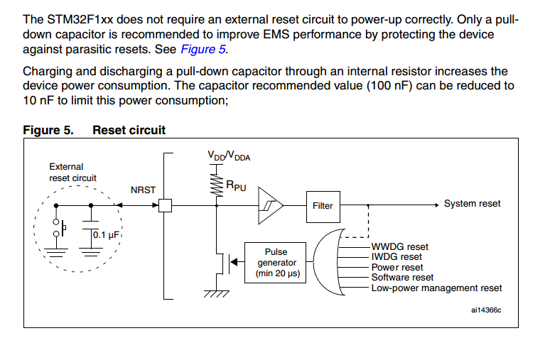

​		根据手册内容，每个复位源对器件进行复位时，都会使脉冲发生器保持最少20uS的的复位脉冲，即保持了`NRST`的持续接地，如果在外部有接看门狗，则此时的看门狗复位引脚输出为高电平，为了避免电流灌入`NRST`，需要在看门狗的复位引脚与`NRST`之间接入限流电阻，因为器件的输入电流大小限制在±5mA，因此通常限流电阻大小为10K。

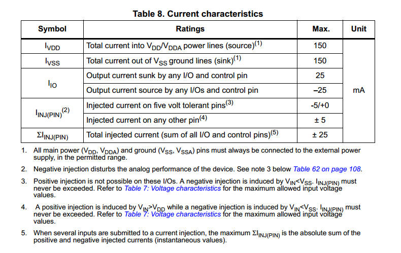

​		或者使用输出电流较小的看门狗芯片，如`TPL5010`，其IO输出电流大小典型值为35nA。

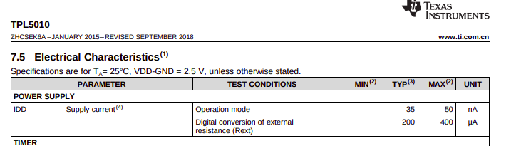

## 2. boot引脚

stm32f1xx系列通常有三种启动方式，根据boot[0-1]引脚的接法不同，分为：

1. NorFlash启动
2. SystemMemory启动
3. SRAM启动

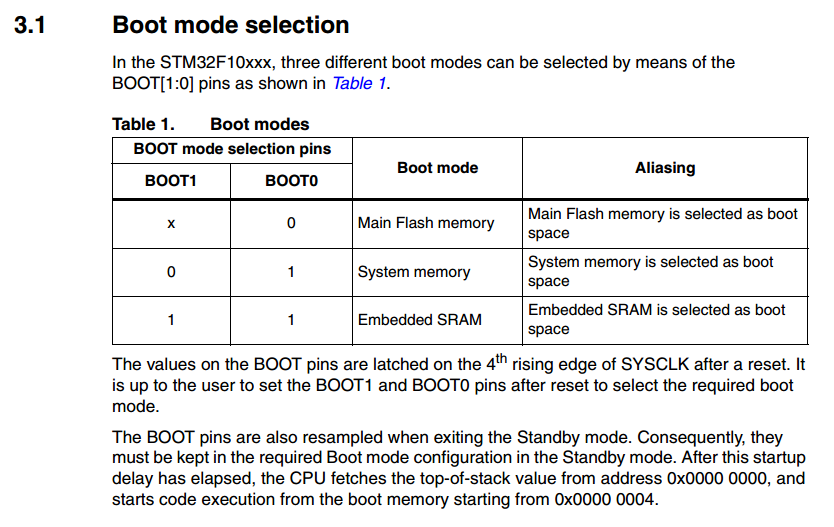

其通常的接法如下：

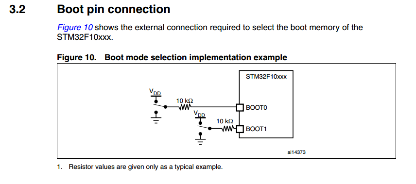

## 3. 晶体振荡器

### 3.1 无源晶体振荡器电路设计要点

​		对于无源晶振，为了获取更高的时钟精度，通常都需要对其进行匹配([晶振设计指导：AN2867](https://www.st.com/content/ccc/resource/technical/document/application_note/c6/eb/5e/11/e3/69/43/eb/CD00221665.pdf/files/CD00221665.pdf/jcr:content/translations/en.CD00221665.pdf))

#### 3.1.1负载电容匹配

​		通常晶振匹配电路如下（其中CL1和CL2就是晶振的匹配电容，通常CL1=CL2）：

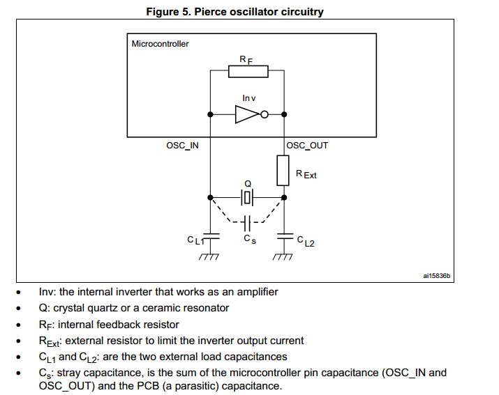

​		其中`RF`反馈电阻的存在使得逆变器`Inv`充当了放大器的功能，通常在绝大多数的ST的微控制器中，`RF`反馈电阻都集成在器件内部。

​		`CL1`和`CL2`为无源晶振的匹配电容，其与`Cs`（OSC_IN与OSC_OUT的引脚电容和PCB的寄生电容之和）共同决定了无源晶振的负载电容`CL`，其公式如下：

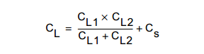

​		其中`CL`从选择的无源晶振的数据手册中获取，`Cs`中包括OSC引脚之间的电容和PCB的寄生电容，OSC引脚之间的电容可从stm32f1xx系列的手册中获取，PCB的寄生电容通常为2pF至5pF。

​		以stm32f1xx系列和晶光华`SMD5032 8MHZ 20PF 10PPM`的匹配为例，查看晶振手册可知其`CL`为20pF，查看stm32f1xx的数据手册([datasheet](https://www.st.com/resource/en/datasheet/stm32f103ve.pdf))可知其OSC_IN的输入电容为5pF，PCB的寄生电容取5pF，因此，`CL`为20pF，`Cs`为10pF，代入公式：

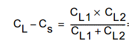

其中，通常`CL1`与`CL2`相等，因此计算得到`CL1=CL2=(CL-Cs)*2=20pF`

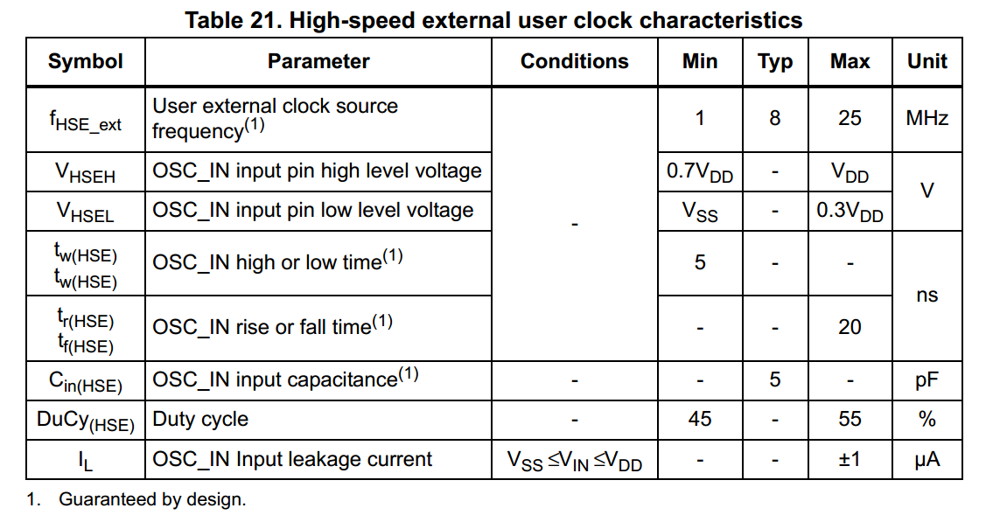

#### 3.1.2 晶振跨导

​		为了晶振可以正常起振，并稳定运行，就必须有足够的增益来维持。如果振荡器的跨导参数`gm`已指定(stm32f1xx手册可查)，则晶振的振荡回路临界增益`gmcrit`必须比`gm`小5倍以上。

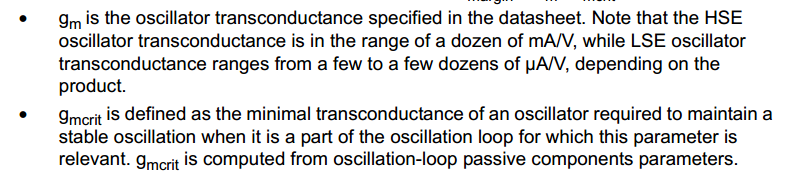

​		查手册([datasheet](https://www.st.com/resource/en/datasheet/stm32f103ve.pdf))可知`gm`为25mA/V

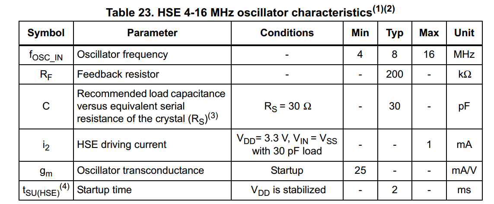

​	接着计算`gmcrit`，其公式为：

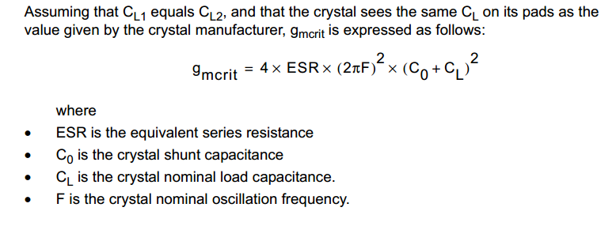

​		查看晶振的手册可知，`C0`为5pF，`F`为8M，`CL`为20pF，`ESR`为80欧姆：

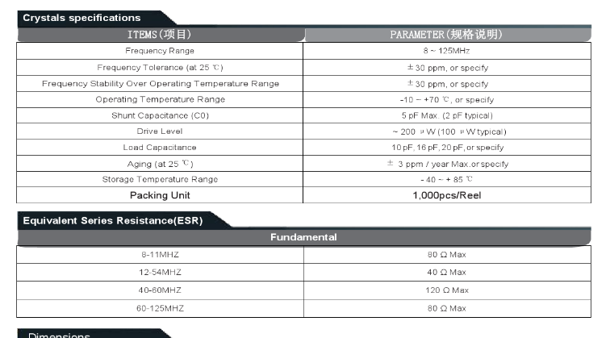

​		因此，计算得到`gmcrit`=0.5048mA/V，所以`gm/gmcrit`=49.5，满足5倍的要求，所以晶振的选择是合适的，若计算得到小于5倍，则应该更换晶振，选择`ESR`更小或者`CL`更小的晶振以满足设计需要。

#### 3.1.4 Driver Level

​		`DL(Driver Level)`是指在晶体内部的功耗，如果不对其进行限制，则有可能导致晶体因过渡机械振动而失效或缩短其使用寿命。以上面的晶光华的无源晶振为例，从其手册内可知该晶振的`DL`最大值为200uW。

​		`DL`的计算公式为：

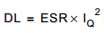

​		因此可以计算得到`IQmax`:

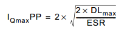

​		当实际测得`IQ`小于`IQmax`时，无需增加限流电阻。

​		关于限流电阻的阻值计算，通常认为其值与`CL2`的感抗相等，其计算公式为：

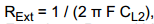

​		如`F`为8M，`CL2`为15pF，则`Rext`等于1326欧姆。