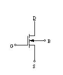
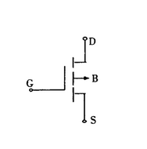

# MOS管原理及分析

## 1. MOS管的原理分析

https://zhuanlan.zhihu.com/p/158544121

## 2. MOS管用作电子开关

​		通常使用N沟道增强型MOS管和P沟道增强型MOS管作为电子开关

### 2.1 NMOS增强型

​		VGS与衬底B箭头相反的方向即为导通DS的条件，对于NMOS，VGS>VGS(th)（VGS(th)为开启电压）,DS导通。

​		需要注意的是，若VDS大于一定程度时，会在D极形成预夹断，随着VDS的继续增大，预夹断不断往S极偏移，直至完全关断。

### 2.2 PMOS增强型

​		VSD需呈负压，当VGS<-0.4V时，DS导通，电流由S流向D，当VGS>-0.4时，DS截至。