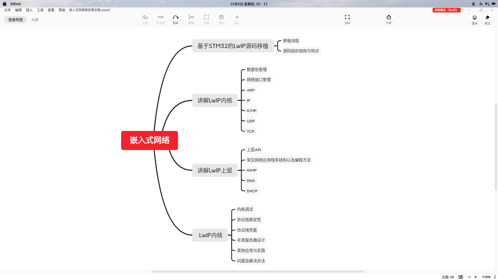
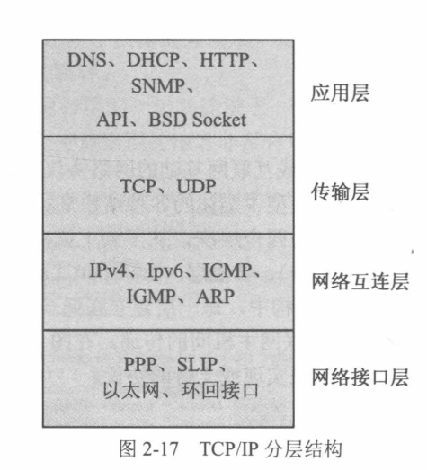
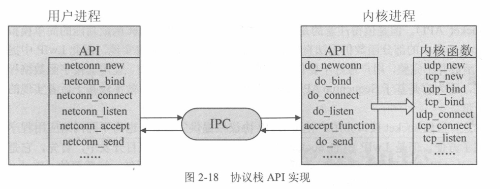
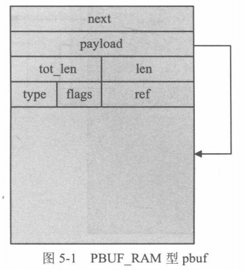
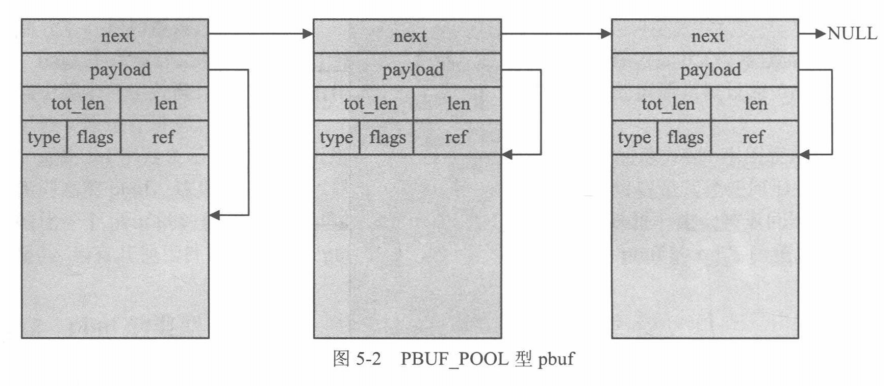
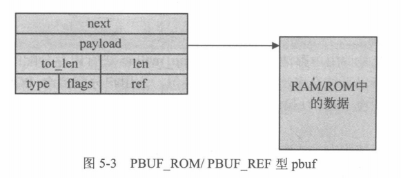

# 嵌入式网络那些事笔记



## 1. 实验平台背后的故事

### 1.1 常用的嵌入式TCP/IP协议栈

|  协议栈   |                             优点                             |                             缺点                             |
| :-------: | :----------------------------------------------------------: | :----------------------------------------------------------: |
|    uIP    |               占用空间小（几60KROM和几百RAM）                | 精简的TCP/IP协议栈，功能不完善，不适合对可靠性要求高，数据传输量大的应用场景 |
|   uC/IP   |             基于uC/OS，代码量中等（30K～60KROM）             | 对网络应用支持不足，文档不完善，移植至其他嵌入式操作系统有一定困难 |
| uC/TCP-IP |                         网络功能齐全                         |          代码量较大、非开源、需要实时操作系统的支持          |
|   LwIP    | 轻量级开源TCP/IP协议栈，可移植操作系统也可裸机运行、支持DNS、SNMP、DHCP、IGMP等高级应用 |                                                              |


## 2. LwIP协议栈初体验

### 2.1 源码目录结构介绍

#### 2.1.1顶层目录

├── CHANGELOG	
├── COPYING
├── doc					相关API使用介绍和移植说明
├── FILES
├── README
├── src					 源码目录
├── test					协议栈内核测试代码
└── UPGRADING

#### 2.1.2 doc目录

doc
├── contrib.txt
├── FILES
├── rawapi.txt				Raw/CallBack 方式的API介绍
├── savannah.txt
├── snmp_agent.txt
└── sys_arch.txt			协议栈移植说明，必须实现的函数及宏定义

#### 2.1.3 src目录

src/
├── api							Sequential API 和 Socket API的代码
├── core						  协议栈核心代码
├── include					 协议栈所使用的所有头文件
└── netif						  与底层网络接口相关的代码

#### 2.1.4 src/core目录

src/core/
├── def.c	   包含了IP层使用到的一些功能函数，如IP地址转换、网络字节序与主机字节序的转换
├── dhcp.c    实现了动态主机配置协议DHCP的客户端所有代码，属于应用层，一般基于UDP协议，用于获取有效的IP地址
├── dns.c	   实现了域名系统DNS客户端的所有代码，属于应用层，一般基于UDP协议，根据域名获取IP地址
├── init.c		LwIP协议栈初始化相关的函数
├── ipv4		 IPv4标准中与IP层数据包处理有关的代码
├── ipv6		 IPv6标准中与IP层数据包处理有关的代码
├── mem.c	实现了协议栈内存堆管理函数
├── memp.c  实现了协议栈内存池管理函数
├── netif.c     实现了协议栈网络接口管理的函数，协议栈支持多种网络接口，包括以太网，SLIP等
├── pbuf.c	 实现协议栈内核使用的数据包管理函数
├── raw.c	  给应用层提供了直接与IP数据包交互的函数
├── snmp	 SNMP为互联网上设备管理的框架，属于应用层，其定义是基于TCP/IP协议，LwIP中使用UDP实现
├── stats.c	实现了协议栈内部数据统计与显示的函数，如内存使用情况等
├── sys.c	   基于操作系统模拟层的信号量机制完成睡眠一段时间的功能，其基础是必须提供sys_arch.c的操作系统模拟层
├── tcp.c	   实现了TCP控制块操作的函数
├── tcp_in.c  实现了TCP协议中数据接收与处理的函数
├── tcp_out.c 实现了TCP协议中数据发送和超时重传的函数
├── timers.c  统一了协议栈内各个协议定时事件处理函数的封装，同时对各个定时事件进行处理
└── udp.c	  实现了UDP协议控制块管理、数据收发的函数

#### 2.1.5 src/core/ipv4目录

core/ipv4
├── autoip.c			 IP自动分配功能相关的函数，若DHCP失败，则会启动AUTOIP功能来配置自身的IP
├── icmp.c				实现了ICMP协议的相关函数，用于为IP数据包传递过程中的差错报告、差错纠正以及目的地质的可达性测试，如Ping命令
├── igmp.c				实现了网络组管理协议IGMP的相关函数，用于提供多播数据传输
├── inet.c				   空
├── inet_chksum.c   IP数据包校验的相关函数
├── ip_addr.c			实现了几个比较简单的IP地址处理函数
├── ip.c					  包含IPV4协议实现的相关函数，如数据包的接收、递交和发送
└── ip_frag.c			 提供了IP数据包分片和重组相关的函数

-----

### 2.2 协议栈框架

####  2.2.1 协议栈分层思想



##### 2.2.1.1 网络接口层

​		网络接口层是TCP/IP协议模型的最底层，主要负责网络数据帧的发送和接收，数据帧是底层网络传输的基本单元，网络接口层可以有不同的实现方式，比如有线和无线的方式发送数据帧，不同的实现方式意味着不同的数据帧结构以及发送速率等。网络接口层的作用在于将上层网络层的数据组装成特定的数据帧并发送出去以及接收网络中发送给自己的特定的数据帧，解构成数据递交上层网络层。

##### 2.2.1.2 网络层

​		网络层负责在主机之间的通信中选择数据报的传输路径(路由)。当网络层接收到上层传输层的数据分组后，把分组封装在IP数据报中，填入数据报的首部，根据路由算法确定是直接交付数据报，还是把数据报传递给路由器。

​		同时网络层还要负责处理传入的数据报，检验其数据有效性，判断该数据报是否是给本机的，如果不是，则使用路由算法将数据报转发出去；如果是，则去除数据报的首部得到数据分组，然后将数据分组递交给上层传输层。

##### 2.2.1.3 传输层

​		传输层主要提供应用程序之间的通信服务，这种通信成为端到端通信。传输层协议将上层应用层要发送的数据流划分为分组，同时将每个分组连同目的地址一同交给网络层去发送。传输层要系统地管理两端数据的准确交互，要提供可靠的传输服务，以确保数据到达无差错、无乱序。因此传输层协议可以采用协商、确认和重发机制。

##### 2.2.1.4 应用层

​		应用层位于分层模型的最高层，利用传输层提供的数据传输服务将自己的数据发送到对方。

----

#### 2.2.2 进程模型

​		LwIP采用的进程模型，将协议栈内核和操作系统内核互相隔离，而同时整个协议栈作为操作系统的一个单独进程存在，用户应用程序可以选择驻留在协议栈内核进程中，也可以实现为一个单独的进程，前者采用Raw/CallBack的方式实现(回调函数)，后者需要使用协议栈中的操作系统模拟层提供的信号量与邮箱机制，实现用户进程与协议栈内核之间的数据交互（Sequential API 和 socket API）。

----

#### 2.2.3 协议栈编程接口

##### 2.2.3.1 Raw/Callback API

​		基于该接口实现LwIP网络编程时，用户应用程序与协议栈内核处于同一个进程中，协议栈与用户应用程序的通信是基于回调函数来实现的。其优势在于编程的灵活性加大，方便的构造出一个服务器应对多个客户端的TCP并发连接；同时其弊端在于用户应用程序与协议栈内核运行在一个进程中，因此协议栈内核需要等待用户应用程序的执行完成后才可以继续得以运行，不适合在多任务、数据吞吐量大、数据处理时间开销长的场景下使用。

##### 2.2.3.2 Sequential API

​		Sequential API的设计是为了避免用户应用程序与协议栈内核之间进行频繁的数据拷贝，其设计特点在于预设用户应用程序已经了解了协议栈内核的部分结构，API使用这种预知来避免数据的拷贝，用户进程可以直接操作协议栈内核进程中的数据包数据。

​		协议栈API的实现由两部分组成：一部分作为用户编程接口提供给用户，这些函数在用户进程中执行；另一部分驻留在协议栈内核进程中。这两部分的通信使用进程间通信技术(IPC)来实现，如邮箱、信号量和共享内存等。



​		`netbuf`是应用程序描述待发送数据和已接收数据的基本结构，应用程序需要通过操作协议栈内核提供的一系列操作方法对`netbuf`进行数据的读取和填写。

​		不论是UDP还是TCP连接，当协议栈收到数据包后，协议栈都会将数据封装在`netbuf`中并递交给应用程序。在数据发送时，对于TCP连接，用户只需提供待发送数据的起始地址和长度，协议栈内核会根据实际情况将数据封装在合适大小的数据包中，并放入发送队列；对于UDP连接，需要用户自行将数据封装在`netbuf`结构中，当发送函数调用时，协议栈内核直接将该数据包发送出去。

##### 2.2.3.3 Socket API

​		LwIP中的Socket API仅仅是对Sequential API的简单封装，标准socket库中的部分函数并没有得以实现，因此不建议在实际应用程序编写中使用该系列API。

## 3. 网络数据包

lwip的各层之间进行数据包传递时，极力避免对数据包进行拷贝，以实现高效的时间和空间管理，提高协议栈的运行效率。

lwip通过pbuf数据包结构来对协议栈内可能使用的数据包结构进行统一的管理（在pbuf.c和pbuf.h中实现了协议栈数据包管理的数据结构和函数），pbuf的定义如下：

```C
struct pbuf {
	struct pbuf *next;								  /*<< 单链表，指向下一个pbuf */
	void *payload;										/*<< 实际数据的存储地址*/
  	u16_t tot_len;										/*<< 当前pbuf以及链接在之后的所有pbuf所指向的数据的长度之和 */
	u16_t len;												/*<< 当前pbuf中所指向数据的数据长度 */
	u8_t type;												/*<< 当前pbuf的类型 */
	u8_t flags;												/*<< misc flags */
  	u16_t ref;												/*<< 记录了有多少指针指向该pbuf */
};
```

**注：**

* **tot_len：**pbuf链表中的第一个pbuf的`tot_len`表示整个链表所指向的数据的总长度；链表最后的pbuf的`tot_len`则只代表本身所指向的数据的长度，其必然与`len`的值想等。
* **ref：**该字段表示其所在的pbuf被其他指针所引用的次数，当有其他指针指向该pbuf时，必须调用相关接口使得该字段增加。

### 3.1 pbuf类型介绍

pbuf共有四种类型，在pbuf结构中的`type`字段进行记录，四种类型分别为：

```C
typedef enum {
	PBUF_RAM, 					  /*<< pbuf描述的数据在pbuf结构之后的连续内存中 */
  	PBUF_ROM, 					 /*<< pbuf描述的数据存储在ROM中 */
  	PBUF_REF, 					   /*<< pbuf描述的数据在与pbuf结构无关的内存中 */
  	PBUF_POOL 					/*<< pbuf结构与其描述的数据处于同一个内存池中 */
} pbuf_type;
```

**注：**

* **PBUF_RAM：**由内存堆管理器分配的内存空间为该类型。

其申请后的内存空间如下图：



* **PBUF_POOL：**由内存池分配的内存空间为该类型。

其申请后的内存空间如下图：



* **PBUF_ROM：**仅在内存池中申请pbuf的结构大小，而不申请数据空间
* **PBUF_REF：**同`PBUF_ROM`

其申请后的内存空间如下图：



* 不同类型的pbuf可以链接在同一个pbuf链表上

### 3.2 数据包申请

数据包申请函数接口：`pbuf_alloc`

数据包在申请时会根据申请时所在的层次，在分配空间时会预留出该层次所需的协议首部的信息大小并填充

`lwip`共分为四个层次，定义为

```c
typedef enum {
	PBUF_TRANSPORT,	 /*<< 传输层 */
    PBUF_IP,						/*<< 网络层 */
    PBUF_LINK,					/*<< 链路层 */
    PBUF_RAW					/*<< 原始层，不预留空间 */
} pbuf_layer;

/**
  * pbuf_alloc 原型
  */
struct pbuf *pbuf_alloc(pbuf_layer layer, u16_t length, pbuf_type type);
```

### 3.3 数据包释放

在调用pbuf释放函数时，所传入的pbuf参数必须为pbuf链表的首节点，否则会导致严重的错误，释放函数并不对pbuf做安全性验证。

pbuf的ref字段只有为0时，才会被释放，释放后将会遍历pbuf的下一个节点进行释放判断。

## 4. 网络接口管理

网络接口对具体网络硬件、软件进行统一封装，为上层(IP层)提供统一的接口服务。

对于不同的物理网络接口，lwip会为其分配一个`netif`结构，用于描述具体的物理网络接口。

在`lwipopts.h`中定义`LWIP_HAVE_LOOPIF`为1后，即可在`lwip`中使能环回接口功能，在调用`lwip_init`初始化`lwip`协议栈时将会调用`netif_init`函数来初始化`loopif`的`netif`结构，配置其ip为127.0.0.1，网关为127.0.0.1，子网掩码为255.0.0.0。

### 4.1 环回接口

环回接口的数据包发送函数: `netif_loop_output`

当IP层需要发送IP数据包时，发现目的地址是环回地址，则IP层将调用环回接口`netif_loop_output`将数据包挂载到网络接口结构体`netif`的`loop_first`链表上，在有操作系统的环境下，内核将主动调用`netif_poll`将`loop_first`链表上的数据递交给IP层，在无操作系统的环境下，用户需要主动调用`netif_poll`函数来递交`loop_first`链表上的数据包。

在使能了自输入功能后，所有的网络接口`netif`都需要调用`netif_poll`来处理环回接口的数据问题，`netif_poll_all`会遍历`netif_list`链表，将所有的网络接口都调用一次`netif_poll`。在无操作系统环境下，`netif_poll_all`才被定义。

### 4.2 环回接口源码

```c
#if ENABLE_LOOPBACK
/**
 * Send an IP packet to be received on the same netif (loopif-like).
 * The pbuf is simply copied and handed back to netif->input.
 * In multithreaded mode, this is done directly since netif->input must put
 * the packet on a queue.
 * In callback mode, the packet is put on an internal queue and is fed to
 * netif->input by netif_poll().
 *
 * @param netif the lwip network interface structure
 * @param p the (IP) packet to 'send'
 * @param ipaddr the ip address to send the packet to (not used)
 * @return ERR_OK if the packet has been sent
 *         ERR_MEM if the pbuf used to copy the packet couldn't be allocated
 */
err_t
netif_loop_output(struct netif *netif, struct pbuf *p,
       ip_addr_t *ipaddr)
{
  struct pbuf *r;
  err_t err;
  struct pbuf *last;
#if LWIP_LOOPBACK_MAX_PBUFS
  u8_t clen = 0;
#endif /* LWIP_LOOPBACK_MAX_PBUFS */
  /* If we have a loopif, SNMP counters are adjusted for it,
   * if not they are adjusted for 'netif'. */
#if LWIP_SNMP
#if LWIP_HAVE_LOOPIF
  struct netif *stats_if = &loop_netif;
#else /* LWIP_HAVE_LOOPIF */
  struct netif *stats_if = netif;
#endif /* LWIP_HAVE_LOOPIF */
#endif /* LWIP_SNMP */
  SYS_ARCH_DECL_PROTECT(lev);
  LWIP_UNUSED_ARG(ipaddr);

  /* Allocate a new pbuf */
  r = pbuf_alloc(PBUF_LINK, p->tot_len, PBUF_RAM);
  if (r == NULL) {
    LINK_STATS_INC(link.memerr);
    LINK_STATS_INC(link.drop);
    snmp_inc_ifoutdiscards(stats_if);
    return ERR_MEM;
  }
#if LWIP_LOOPBACK_MAX_PBUFS
  clen = pbuf_clen(r);
  /* check for overflow or too many pbuf on queue */
  if(((netif->loop_cnt_current + clen) < netif->loop_cnt_current) ||
     ((netif->loop_cnt_current + clen) > LWIP_LOOPBACK_MAX_PBUFS)) {
    pbuf_free(r);
    LINK_STATS_INC(link.memerr);
    LINK_STATS_INC(link.drop);
    snmp_inc_ifoutdiscards(stats_if);
    return ERR_MEM;
  }
  netif->loop_cnt_current += clen;
#endif /* LWIP_LOOPBACK_MAX_PBUFS */

  /* Copy the whole pbuf queue p into the single pbuf r */
  if ((err = pbuf_copy(r, p)) != ERR_OK) {
    pbuf_free(r);
    LINK_STATS_INC(link.memerr);
    LINK_STATS_INC(link.drop);
    snmp_inc_ifoutdiscards(stats_if);
    return err;
  }

  /* Put the packet on a linked list which gets emptied through calling
     netif_poll(). */

  /* let last point to the last pbuf in chain r */
  for (last = r; last->next != NULL; last = last->next);

  SYS_ARCH_PROTECT(lev);
  if(netif->loop_first != NULL) {
    LWIP_ASSERT("if first != NULL, last must also be != NULL", netif->loop_last != NULL);
    netif->loop_last->next = r;
    netif->loop_last = last;
  } else {
    netif->loop_first = r;
    netif->loop_last = last;
  }
  SYS_ARCH_UNPROTECT(lev);

  LINK_STATS_INC(link.xmit);
  snmp_add_ifoutoctets(stats_if, p->tot_len);
  snmp_inc_ifoutucastpkts(stats_if);

#if LWIP_NETIF_LOOPBACK_MULTITHREADING
  /* For multithreading environment, schedule a call to netif_poll */
  tcpip_callback((tcpip_callback_fn)netif_poll, netif);
#endif /* LWIP_NETIF_LOOPBACK_MULTITHREADING */

  return ERR_OK;
}

/**
 * Call netif_poll() in the main loop of your application. This is to prevent
 * reentering non-reentrant functions like tcp_input(). Packets passed to
 * netif_loop_output() are put on a list that is passed to netif->input() by
 * netif_poll().
 */
void
netif_poll(struct netif *netif)
{
  struct pbuf *in;
  /* If we have a loopif, SNMP counters are adjusted for it,
   * if not they are adjusted for 'netif'. */
#if LWIP_SNMP
#if LWIP_HAVE_LOOPIF
  struct netif *stats_if = &loop_netif;
#else /* LWIP_HAVE_LOOPIF */
  struct netif *stats_if = netif;
#endif /* LWIP_HAVE_LOOPIF */
#endif /* LWIP_SNMP */
  SYS_ARCH_DECL_PROTECT(lev);

  do {
    /* Get a packet from the list. With SYS_LIGHTWEIGHT_PROT=1, this is protected */
    SYS_ARCH_PROTECT(lev);
    in = netif->loop_first;
    if (in != NULL) {
      struct pbuf *in_end = in;
#if LWIP_LOOPBACK_MAX_PBUFS
      u8_t clen = pbuf_clen(in);
      /* adjust the number of pbufs on queue */
      LWIP_ASSERT("netif->loop_cnt_current underflow",
        ((netif->loop_cnt_current - clen) < netif->loop_cnt_current));
      netif->loop_cnt_current -= clen;
#endif /* LWIP_LOOPBACK_MAX_PBUFS */
      while (in_end->len != in_end->tot_len) {
        LWIP_ASSERT("bogus pbuf: len != tot_len but next == NULL!", in_end->next != NULL);
        in_end = in_end->next;
      }
      /* 'in_end' now points to the last pbuf from 'in' */
      if (in_end == netif->loop_last) {
        /* this was the last pbuf in the list */
        netif->loop_first = netif->loop_last = NULL;
      } else {
        /* pop the pbuf off the list */
        netif->loop_first = in_end->next;
        LWIP_ASSERT("should not be null since first != last!", netif->loop_first != NULL);
      }
      /* De-queue the pbuf from its successors on the 'loop_' list. */
      in_end->next = NULL;
    }
    SYS_ARCH_UNPROTECT(lev);

    if (in != NULL) {
      LINK_STATS_INC(link.recv);
      snmp_add_ifinoctets(stats_if, in->tot_len);
      snmp_inc_ifinucastpkts(stats_if);
      /* loopback packets are always IP packets! */
      if (ip_input(in, netif) != ERR_OK) {
        pbuf_free(in);
      }
      /* Don't reference the packet any more! */
      in = NULL;
    }
  /* go on while there is a packet on the list */
  } while (netif->loop_first != NULL);
}

#if !LWIP_NETIF_LOOPBACK_MULTITHREADING
/**
 * Calls netif_poll() for every netif on the netif_list.
 */
void
netif_poll_all(void)
{
  struct netif *netif = netif_list;
  /* loop through netifs */
  while (netif != NULL) {
    netif_poll(netif);
    /* proceed to next network interface */
    netif = netif->next;
  }
}
#endif /* !LWIP_NETIF_LOOPBACK_MULTITHREADING */
#endif /* ENABLE_LOOPBACK */
```

