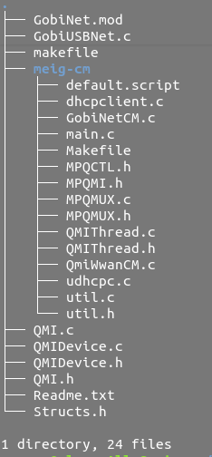
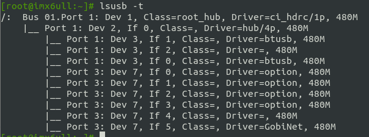
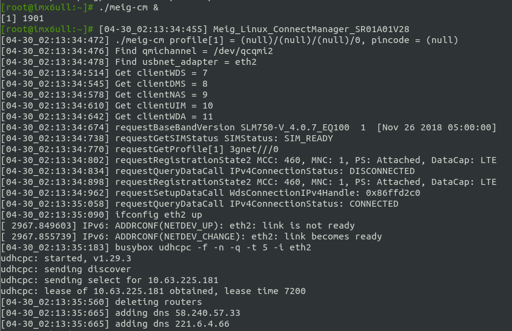

# 美格4G模块调试

```
模块信息：
	厂商：美格
	模块型号：L750
```

使用linux的option+NDIS+GbiNet拨号方式操作模块

## 一、移植

修改`kernel/driver/usb/serial/option.c`以支持美格4G模块的加载

修改步骤如下：

1. 添加系统支持，在`make menuconfig`中打开`USB driver for GSM and CDMA modems`
2. 添加系统支持NDIS驱动，在`make menuconfig`中打开`Multi-purpose USB Networking Framework`
3. 在`option.c`中增加串口ID
4. 在`option.c`中阻止NDIS和ADB端口加载为串口

`option.c`修改内容如下：

```
diff --git a/drivers/usb/serial/option.c b/drivers/usb/serial/option.c
index 1799aa058a5b..751e56308c88 100644
--- a/drivers/usb/serial/option.c
+++ b/drivers/usb/serial/option.c
@@ -238,6 +238,8 @@ static void option_instat_callback(struct urb *urb);
 #define QUECTEL_PRODUCT_UC15                   0x9090
 /* These Yuga products use Qualcomm's vendor ID */
 #define YUGA_PRODUCT_CLM920_NC5                        0x9625
+/* These MEIG products use Qualcomm's vendor ID */
+#define MEIG_PRODUCT_730                               0xF601
 
 #define QUECTEL_VENDOR_ID                      0x2c7c
 /* These Quectel products use Quectel's vendor ID */
@@ -245,6 +247,11 @@ static void option_instat_callback(struct urb *urb);
 #define QUECTEL_PRODUCT_EC25                   0x0125
 #define QUECTEL_PRODUCT_BG96                   0x0296
 
+/* These MEIG products use MEIG's vendor ID */
+#define MEIG_VENDOR_ID_720                     0x2dEE
+#define MEIG_PRODUCT_720                               0x4D07
+#define MEIG_PRODUCT_720_ECM                   0x4D02
+
 #define CMOTECH_VENDOR_ID                      0x16d8
 #define CMOTECH_PRODUCT_6001                   0x6001
 #define CMOTECH_PRODUCT_CMU_300                        0x6002
@@ -1206,6 +1213,10 @@ static const struct usb_device_id option_ids[] = {
          .driver_info = (kernel_ulong_t)&net_intf4_blacklist },
        { USB_DEVICE(QUECTEL_VENDOR_ID, QUECTEL_PRODUCT_BG96),
          .driver_info = (kernel_ulong_t)&net_intf4_blacklist },
+       /* MEIG products use Qualcomm vendor ID */
+       { USB_DEVICE(QUALCOMM_VENDOR_ID, MEIG_PRODUCT_730) },
+       { USB_DEVICE(MEIG_VENDOR_ID_720, MEIG_PRODUCT_720) },
+       { USB_DEVICE(MEIG_VENDOR_ID_720, MEIG_PRODUCT_720_ECM) },
        { USB_DEVICE(CMOTECH_VENDOR_ID, CMOTECH_PRODUCT_6001) },
        { USB_DEVICE(CMOTECH_VENDOR_ID, CMOTECH_PRODUCT_CMU_300) },
        { USB_DEVICE(CMOTECH_VENDOR_ID, CMOTECH_PRODUCT_6003),
@@ -2137,6 +2148,15 @@ static int option_probe(struct usb_serial *serial,
            dev_desc->idProduct == cpu_to_le16(SAMSUNG_PRODUCT_GT_B3730) &&
            iface_desc->bInterfaceClass != USB_CLASS_CDC_DATA)
                return -ENODEV;
+       
+       /*
+        * Don't bind network interface on MEIG L730, it is handled by
+        * a separate module.
+        */
+       if (dev_desc->idVendor == QUALCOMM_VENDOR_ID &&
+           dev_desc->idProduct == MEIG_PRODUCT_730 &&
+               iface_desc->bInterfaceNumber >= 4)
+               return -ENODEV; 
 
        /* Store the blacklist info so we can use it during attach. */
        usb_set_serial_data(serial, (void *)blacklist);

```

## 二、编译

美格提供的驱动源码目录结构如下:



### 1.设置交叉编译工具链

`export CROSS_COMPILE=arm-linux-gnueabihf-` 

### 2.设置内核目录

`export KDIR=/home/cenyue/Desktop/item/1.linux/code/imx6ultralite/100ask_imx6ull/code/100ask_imx6ull-sdk/Linux-4.9.88/`

### 3. 设置cpu架构

`export ARCH=arm`

### 4.编译

`make`

具体过程如下：

```bash
cenyue@sluan-All-Series:~/Desktop/item/1.linux/code/imx6ultralite/100ask_imx6ull/code/Meig_GobiNet_Driver/Meig_GobiNet_Driver_V1.3.0  $ export ARCH=arm
cenyue@sluan-All-Series:~/Desktop/item/1.linux/code/imx6ultralite/100ask_imx6ull/code/Meig_GobiNet_Driver/Meig_GobiNet_Driver_V1.3.0  $ export CROSS_COMPILE=arm-linux-gnueabihf-
cenyue@sluan-All-Series:~/Desktop/item/1.linux/code/imx6ultralite/100ask_imx6ull/code/Meig_GobiNet_Driver/Meig_GobiNet_Driver_V1.3.0  $ export KDIR=/home/cenyue/Desktop/item/1.linux/code/imx6ultralite/100ask_imx6ull/code/100ask_imx6ull-sdk/Linux-4.9.88/
cenyue@sluan-All-Series:~/Desktop/item/1.linux/code/imx6ultralite/100ask_imx6ull/code/Meig_GobiNet_Driver/Meig_GobiNet_Driver_V1.3.0  $ make
ln -sf makefile Makefile
make ARCH=arm CROSS_COMPILE=arm-linux-gnueabihf- -C /home/cenyue/Desktop/item/1.linux/code/imx6ultralite/100ask_imx6ull/code/100ask_imx6ull-sdk/Linux-4.9.88/ M=/home/cenyue/Desktop/item/1.linux/code/imx6ultralite/100ask_imx6ull/code/Meig_GobiNet_Driver/Meig_GobiNet_Driver_V1.3.0 modules
make[1]: Entering directory '/home/cenyue/Desktop/item/1.linux/code/imx6ultralite/100ask_imx6ull/code/100ask_imx6ull-sdk/Linux-4.9.88'
  CC [M]  /home/cenyue/Desktop/item/1.linux/code/imx6ultralite/100ask_imx6ull/code/Meig_GobiNet_Driver/Meig_GobiNet_Driver_V1.3.0/GobiUSBNet.o
/home/cenyue/Desktop/item/1.linux/code/imx6ultralite/100ask_imx6ull/code/Meig_GobiNet_Driver/Meig_GobiNet_Driver_V1.3.0/GobiUSBNet.c: In function ‘GobiUSBNetProbe’:
/home/cenyue/Desktop/item/1.linux/code/imx6ultralite/100ask_imx6ull/code/Meig_GobiNet_Driver/Meig_GobiNet_Driver_V1.3.0/GobiUSBNet.c:2073:1: warning: control reaches end of non-void function [-Wreturn-type]
 }
 ^
  CC [M]  /home/cenyue/Desktop/item/1.linux/code/imx6ultralite/100ask_imx6ull/code/Meig_GobiNet_Driver/Meig_GobiNet_Driver_V1.3.0/QMIDevice.o
  CC [M]  /home/cenyue/Desktop/item/1.linux/code/imx6ultralite/100ask_imx6ull/code/Meig_GobiNet_Driver/Meig_GobiNet_Driver_V1.3.0/QMI.o
  LD [M]  /home/cenyue/Desktop/item/1.linux/code/imx6ultralite/100ask_imx6ull/code/Meig_GobiNet_Driver/Meig_GobiNet_Driver_V1.3.0/GobiNet.o
  Building modules, stage 2.
  MODPOST 1 modules
  CC      /home/cenyue/Desktop/item/1.linux/code/imx6ultralite/100ask_imx6ull/code/Meig_GobiNet_Driver/Meig_GobiNet_Driver_V1.3.0/GobiNet.mod.o
  LD [M]  /home/cenyue/Desktop/item/1.linux/code/imx6ultralite/100ask_imx6ull/code/Meig_GobiNet_Driver/Meig_GobiNet_Driver_V1.3.0/GobiNet.ko
make[1]: Leaving directory '/home/cenyue/Desktop/item/1.linux/code/imx6ultralite/100ask_imx6ull/code/100ask_imx6ull-sdk/Linux-4.9.88'
```

## 三、编译拨号程序

`cd meig-cm`

`make`

## 四、安装驱动及启动拨号

 ### 1.安装驱动

`insmod GobiNet.ko`

### 2. 插入4G模块并查看信息

`lsusb -t`



### 3.启动拨号程序后台执行

`./meig-cm &`



### 4. 添加外网路由

`route add -net 0.0.0.0 eth2`

查看路由状态:


### 5. ping外网

