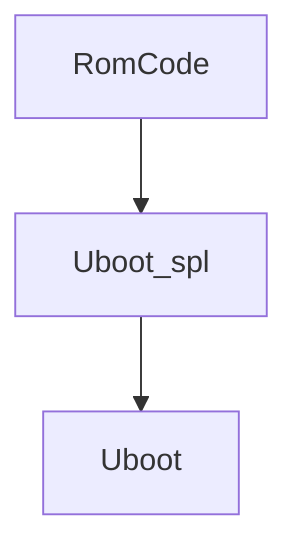

# AM335X SD/MMC 的RAW模式启动

am335x上电时会启动内置的RomCode段代码，该段程序的功能是检测外部启动方式，根据SYSBOOT引脚的配置情况按照固定的启动顺序去寻找有效的`Uboot_spl`，本文就`RomCode`在`raw`模式下如何识别MMC/SD Card中的`Uboot_spl`做说明。

在`raw`模式下，可以将`Uboot_spl.bin`放置在4个固定位置，分别是0x0/0x2000/0x40000/0x60000，因此`Uboot_spl.bin`不应该大于0x20000(128KB)，但实际使用的`Uboot_spl.bin`大小不应该大于109KB，其原因是因为`am335x`的内部`SRAM`大小为127K(0x402F0400-0x4030FFFF)，但实际上0x4030B800-0x4030FFFF这段`SRAM`被`RomCode`所使用，因此实际可供`Uboot_spl.bin`所使用的最大的容量为109K(0x4020F0400-0x4030B7FF)。

`RamCode`在查找`Uboot_spl.bin`时，先在0x0地址上查找`TOC`信息，0x0地址上第一个字的内容不为0xFFFFFFFF和0x00000000且`TOC`内容中有`CHSETTINGS`字段，则去第二个section（512KB）处获取`GP Header`，根据`GP Header`内的信息拷贝`Uboot_spl.bin`至目标地址并启动。

因此在制作启动卡时，在第一个section(512字节)中需要放置一块`TOC`信息表（最多放置两块`TOC`表，每一块32字节，彼此首尾相连），第二块TOC必须填充为0xFF。紧跟`TOC`表后的两个字内容为`Magic number`，其内容必须为`0xC0C0C0C1`和`0x00000100`，在第一个section中，除了`TOC`和`Magic number`，其他内容必须为0x0

第二个section中包含2个字的`GP Header`以及`Uboot_spl.bin`，其中Size为`Uboot_spl.bin`的大小，`Destination`为需要将`Uboot_spl.bin`加载的目标地址，一般为`0x402F0400`

`RomCode`识别到`TOC`和`GP Header`后即将`Uboot_spl.bin`加载至内部`SRAM`并运行。