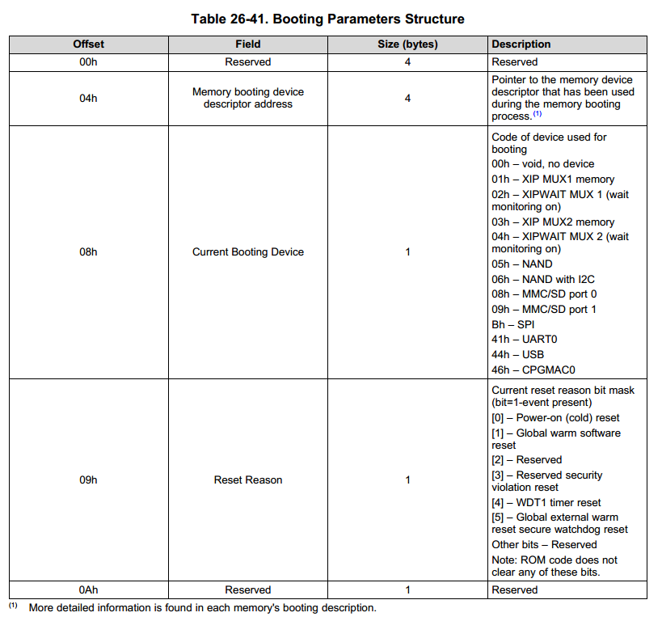

# uboot 2015.10 启动过程分析

Arch: arm

SoC: am3352

board: ant(与Beaglebone Black相似，emmc替换为Nand)


* 开发板的移植过程可参考：[ant开发板移植过程](uboot2015.10_移植过程.md)


## 前言

目前的开发板通常使用MMC/SD、EMMC以及Nand之类的非XIP的存储设备来存储Uboot以及Kernel的代码（关于Nand Flash的非XIP和Nor Flash的XIP区别可参考[Nand基本原理](https://zhuanlan.zhihu.com/p/77492720)），因此通常SoC内部会内置一块SRAM(am335x内置了128K的SRAM)用于运行uboot的第一阶段BL1，在BL1中初始化好DRAM后再将完整的uboot即BL2，拷贝至链接地址处运行，完成uboot的其他功能，因此uboot构建了一套spl的通用代码框架，用于适应不同的SoC的启动阶段，该框架在配置文件中选择是否启用，以ant开发板为例，在configs/am335x_ant_defconfig中：

```C
CONFIG_SPL=y					// 选择开启spl
CONFIG_SYS_EXTRA_OPTIONS="NAND"
CONFIG_CONS_INDEX=1
+S:CONFIG_ARM=y
+S:CONFIG_TARGET_AM335X_ANT=y
```

开启了spl功能后，在uboot的编译过程中会编程生成两份image，一份为u-boot-spl.bin（包含spl部分的BL1），另一份为u-boot.bin（不包含spl部分的BL2），BL1在SRAM中运行，BL2在DDR中运行。


## uboot spl 分析

### 入口点分析

首先找到u-boot-spl.bin的入口点，一般入口点会在链接脚本中指定，那么找到生成u-boot-spl.bin的连接脚本即可找到入口点，u-boot-spl.bin的链接脚本使用的是spl目录下的u-boot-spl.lds，查看内容为：

```c
MEMORY { .sram : ORIGIN = 0x402F0400, LENGTH = (0x4030B800 - 0x402F0400) }
MEMORY { .sdram : ORIGIN = 0x80a00000, LENGTH = 0x80000 }
OUTPUT_FORMAT("elf32-littlearm", "elf32-littlearm", "elf32-littlearm")
OUTPUT_ARCH(arm)
ENTRY(_start)
SECTIONS
{
 .text :
 {
  __start = .;
  *(.vectors)
  arch/arm/cpu/armv7/start.o (.text)
  *(.text*)
 } >.sram
 . = ALIGN(4);
 .rodata : { *(SORT_BY_ALIGNMENT(.rodata*)) } >.sram
 . = ALIGN(4);
 .data : { *(SORT_BY_ALIGNMENT(.data*)) } >.sram
 .u_boot_list : {
  KEEP(*(SORT(.u_boot_list*)));
 } >.sram
 . = ALIGN(4);
 __image_copy_end = .;
 .end :
 {
  *(.__end)
 } >.sram
 .bss :
 {
  . = ALIGN(4);
  __bss_start = .;
  *(.bss*)
  . = ALIGN(4);
  __bss_end = .;
 } >.sdram
}
```

其中ENTRY(_start)指定了入口点为` _start`

那么如何确定spl目录下的u-boot-spl.lds即为真正的链接脚本？

在根目录下的Makefile中找到以u-boot-spl.bin的目标的语句（line1193-1196）：

```
spl/u-boot-spl.bin: spl/u-boot-spl
	@:
spl/u-boot-spl: tools prepare
	$(Q)$(MAKE) obj=spl -f $(srctree)/scripts/Makefile.spl all
```

生成spl/u-boot.spl.bin依赖于spl/u-boot-spl，生成spl/u-boot.spl调用了scripts目录下的Makefile.spl，此时obj的值为spl。

在`scripts/Makefile.spl`中找到如下语句：

```
ifeq ($(CONFIG_TPL_BUILD),y)
export CONFIG_TPL_BUILD
SPL_BIN := u-boot-tpl
else
SPL_BIN := u-boot-spl
endif

$(obj)/$(SPL_BIN).bin: $(obj)/$(SPL_BIN) FORCE
	$(call if_changed,objcopy)

$(obj)/$(SPL_BIN): $(u-boot-spl-init) $(u-boot-spl-main) $(obj)/u-boot-spl.lds FORCE
	$(call if_changed,u-boot-spl)

$(obj)/u-boot-spl.lds: $(LDSCRIPT) FORCE
	$(call if_changed_dep,cpp_lds)
	
# Linker Script
ifdef CONFIG_SPL_LDSCRIPT
# need to strip off double quotes
LDSCRIPT := $(addprefix $(srctree)/,$(CONFIG_SPL_LDSCRIPT:"%"=%))
endif
```

由此确定了链接脚本就是`spl/u-boot-spl.lds`。

追本溯源，`spl/u-boot-spl.lds`的生成又依赖于CONFIG_SPL_LDSCRIPT这个宏，这个宏在`include/configs/am335x_ant.h`中被定义：

```c
#define CONFIG_SPL_LDSCRIPT		"$(CPUDIR)/am33xx/u-boot-spl.lds"
```

其源文件为`arch/arm/cpu/armv7/am335x/u-boot-spl.lds`，至于如何将该lds文件生成spl/u-boot-spl.lds暂时按下不表。


### 源码分析

由上面的分析可知入口点为` _start`，其处于`arch/arm/lib/vectors.S`内：

```asm
# arch/arm/lib/vectors.S
_start:

#ifdef CONFIG_SYS_DV_NOR_BOOT_CFG
	.word	CONFIG_SYS_DV_NOR_BOOT_CFG
#endif

	b	reset
	ldr	pc, _undefined_instruction
	ldr	pc, _software_interrupt
	ldr	pc, _prefetch_abort
	ldr	pc, _data_abort
	ldr	pc, _not_used
	ldr	pc, _irq
	ldr	pc, _fiq
```

进入 _start之后立即调用reset（arch/arm/cpu/armv7/start.S）

```assembly
# arch/arm/cpu/armv7/start.S
	.globl	reset

reset:
	bl	save_boot_params
	/*
	 * disable interrupts (FIQ and IRQ), also set the cpu to SVC32 mode,
	 * except if in HYP mode already
	 */
	mrs	r0, cpsr
	and	r1, r0, #0x1f		@ mask mode bits
	teq	r1, #0x1a		@ test for HYP mode
	bicne	r0, r0, #0x1f		@ clear all mode bits
	orrne	r0, r0, #0x13		@ set SVC mode
	orr	r0, r0, #0xc0		@ disable FIQ and IRQ
	msr	cpsr,r0
```

调用`save_boot_params`讲am335x的`RomCode`代码执行后的参数保存起来，该参数包括了以下信息：



